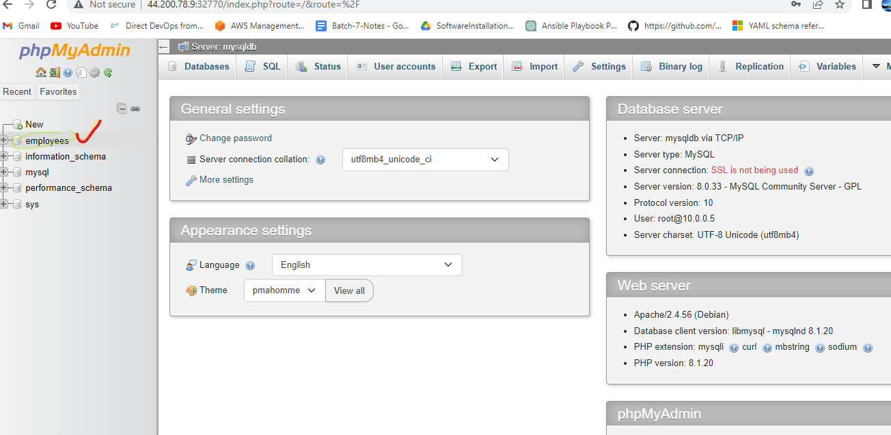

###  15/Apr/2023 (Evening)

(.) dot is current directory

* Docker Volume contd..

* Persisting Data using Volumes

   ` docker volume create mysqldb `

     * Lets create an explicit volume for mysqldb

       * Lets use volume type to mount the mysqldb

     * Create a mysql container

     * open this link for official doc..  https://docs.docker.com/storage/volumes/#start-a-container-with-a-volume

     ` docker contauiner run -d --name mysqldb -v mysqldb:/var/lib/mysql -P mysql `
     
     ` docker container ls `
          

    * docker container is not running

      ` docker container rm -f $(docker container ls -a -q) `  ---deleted
     
       ` docker container run -d --name mysqldb -v mysqldb:/var/lib/mysql -P mysql:5.6 ` 

       
      * container not running 

      ` docker container ls ` --- here alo container not running
      
       
       ` docker container logs mysqldb `
       
       
       ` docker container rm -f $(docker container ls -a -q) `
    
      ` docker container run -d --name mysqldb -v mysqldb:/var/lib/mysql -P -e MYSQL_ROOT_PASSWORD=rootroot -e MYSQL_DATABASE=employees -e MYSQL_USER=qtdevops -e MYSQL_PASSWORD=rootroot mysql `

      

      ` docker container ls `
      
      
     ` docker container exec -it mysqldb mysql --password=rootroot `
     

     ` use employees; `
      it will show database changed
      
        ` CREATE TABLE Persons (
              PersonID int,
              LastName varchar(255),
              FirstName varchar(255),
              Address varchar(255),
              City varchar(255)
          ); `

          ` insert into Persons Values ( 1,'test','test','test','test' ); `
          ` Select * from Persons; `
     
        
         exit 

         ` docker container rm -f mysqldb `
         ` docker container run -d --name mysqldb --mount "source=mysqldb,target=/var/lib/mysql,type=volume" -P -e MYSQL_ROOT_PASSWORD=rootroot -e MYSQL_DATABASE=employees -e MYSQL_USER=qtdevops -e MYSQL_PASSWORD=rootroot mysql `

         creating mount container creating 10 touch files

         Lets use bindmount to mount /tmp on docker host to the container /tmp
         ` docker container run -d --name exp1 -v /tmp:/tmp ubuntu:22.04 sleep 1d `
         ` docker container run -d --name exp1 --mount "source=/tmp,target=/tmp,type=bind" ubuntu:22.04 sleep 1d `

          ` docker container run -d --name exp1 -v /tmp:/tmo ubuntu:22.04 sleep 1d `
    

         ` docker container exec -it exp1 /bin/bash
          ` df -h `
    
          
          ` ls /tmp `
          ` touch /tmp/{1..10}.txt `
          ` ls /tmp `
    
          
          we created 10 mounted touch files

          bind mode... docker host ki  container ki same folder undali ankunnappudu bind mode use cheyali... 
          all the data stored in RAM only once system is restart all the data is gone...
          RAM is a valitality storage..

    
    

      Creating volume as part of Dockerfile
      Gameoflife:

      refer here for the changeset with volume instruction for gameoflife container
      https://github.com/asquarezone/DockerZone/commit/f58812733781b7ebed7b2a8d0b0584fe0338c4e6

         Dockerfile for NOPCommers....

         mkdir gol
        ` cd gol `
        vi Dockerfile 

         FROM tomcat:9-jdk8
         LABEL author="raju" organization="qt"
         ARG GOL_URL=https://referenceapplicationskhaja.s3.us-west-2.amazonaws.com/gameoflife.war
         ADD ${GOL_URL} /user/local/tomcat/webapps/gameoflife.war
         VOLUME "/urs/local/tomcat"
         EXPOSE 8080
         # INGORING CMD as i want base image's CMD

       past the abow dockerfile in vi Docker editor...:wq--enter

       ` docker container rm -f $(docker container ls -a -q) `
       ` docker volume prune `
       ` docker volume ls `
       ` docker image build -t raju:1.0 .`
    
       
       ` docker volume ls `
       ` docker container run -d --name raju1 -P raju:1.0 `
    
       ` docker container ls `
    
       ` docker volume ls `
    
        
         when ever we start a container volume get created
         as wel as mysql aslo automatically creating volumes
        
        ` docker volume inspect 742043d71b501376d943b2e65214205693b08c1440c7e24d32d5be2caaf990c4 `
        volume creating data storing inthis location
    
     
        ` docker container rm -f $(dockeer container ls -a -q) `
        ` docker volume prune `
        ` docker image rm -f $(docker image ls -a -q) `

    Shell file to clean everything
     
     Create a shell file with following content

      ` #!/bin/bash
        docker container rm -f $(docker container ls -a -q)
        docker volume prune
        docker image rm -f $(docker image ls -q) `

     Entrypoint and CMD

       Lets create two docker images

       1 first

       FROM alpine
       CMD [ "sleep","1d" ]

      `  mkdir entrypoint1 `

      ` cd entrypoint1 `
      ` vi first `
      ` docker image build -t g1 -f c1 . `
      ` docker container run g1 ping -c 4 google.com `
       
      
      2 Second

      FROM alpine
      ENTYPOINT [ "sleep" ]
      CMD [ "1d" ]
     
     ` mkdir second `
     ` cd second2 `
     ` vi second2 `
     ` docker image build -t second2 -f c2 . `
    
      
     ` docker container run second2 ping -c 4 google.com ` 
        
           it wil show error because of " ping -c 4 " becomes to argumets to sleep doesnt know what ping is...
    

     ` docker container run second2 10s `
       
       it will run 10s seconds after that its stoping...
    

      container not allowing entrypoint if you want pass the entrypoint you have to pass argumet..

      ` docker container run --entrypoint ping second2 -c 4 google.com
    

      image name tharvatha manam ami rashina adhi CND ni mathrame change chesthundhi entrypoint nu kadhu
      entrypoint is also we can change but we have to pass to argument...

      ` docker container ls -a `
    

      ` docker container rm -f $(docker container ls -a -q) `
      ` alias prunvol='docker volume prune' `
      ` alias delimages='docker image rm -f $(docker image ls -a -q)' `
      ` prunvol `
      ` delimages `
   

      Now we understand why sleep container 1day        
      
      ` docker container run -d --name c20 alpine sleep 1d `
      ` docker container run -d --name c21 alpine sleep 1d `
    

      ` docker container inspect c20 `
    

      ` docker container inspect c21 `
    

      ` docker container exec c20 ping -c 1 172.17.0.4 `
      
      Now login into C1 and ping C2 by using its ipaddress
      Observation Results
         ping by name is not working
         ping by ip is working
    
      
       c20 container is speak over the c21 container...

    

    Take a new VM

      ` sudo apt update `
      ` sudo apt install net-tools -y `
    

      ` ifconfig `
      network inter faces...
    

       Now install docker and check network interfaces again...
    
     ` curl -fsSL https://test.docker.com -o test-docker.sh `
      `  sh test-docker.sh `
    
       
       A docker0 network interface is added.

      ` docker container run -it ubuntu:22.04 /bin/bash `

      ` apt update `
      ` apt install net-tools -y `
      ` ifconfig `
     
        its totally run in inside the containers...
      

      ` ping directdevops.blogs `
    

        we knowing ip address ....

     for name servers ip...
     ` nslookup directdevops.blog `
    
     
     Docker Networking Architecture

     Docker Networking Architecture is based on Container Networking Model.

    

     CNM Constructs – Sandbox

        Contains the configuration of the containers network stack.
        Includes routing tables, container’s interfaces, DNS setting etc.
        Sample implementation could be Linux Network Namespace or any other similar concept.

    CNM Constructs – Endpoint
        Joins sandbox to the Network.
        This abstracts actual connection to the network away from application.
        Maintains portability for applications, so that they can use different network drivers  
    CNM Constructs – Network
        Collection of endpoints having connectivity b/w themselves

    CNM Driver Interfaces
        CNM provides two pluggable & open interfaces to leverage additional functionality and control in the network
           Network Drivers
           IPAM Drivers
    

      ` docker network ls `
    

    Docker Native Network Drivers

    for docker network artical link...https://directdevops.blog/2019/10/05/docker-networking-series-i/

        Host
          Container uses the networking stack of the host.
        Bridge
          Creates a bridge on the host that is managed by Docker.
          All containers on Bridge Driver can communicate among themselves.
          Default Driver.
        Overlay
          Used for multi-host networks.
          uses local linux bridges & VXLAN to overlay container-to-container networking.
        MACVLAN
          uses Linux MACVLAN bridge to establish connection b/w container interfaces & parent host interfaces.
          MAC address can be attached to each container.

       ` docker container run -d --name c1 alpine 1d `
       ` docker container inspect c1 `
       c1  is a bridge network...
    

       ` docker network inspect bridge `
    

     
      ` docker network create -d bridge --subnet "10.0.0.0/24" my_bridge `
          
          -d  means driver  
    

        ` docker network ls `
    

     ` docker container run -d --name c2 --network my_bridgealpine sleep 1d `
     ` docker container run -d --name c3 --network my_bridgealpine sleep 1d `
    

     ` docker container exec c2 ping -c 2 c3 `
     

      ` docker container exec c2 ping -c 2 10.0.0.3 `
      

    
    Lets create a mysql container in my_bridge network

      ` docker container run -d --name mysqldb -v mysqldb:/var/lib/mysql -P -e MYSQL_ROOT_PASSWORD=rootroot -e MYSQL_DATABASE=employees -e MYSQL_USER=qtdevops -e MYSQL_PASSWORD=rootroot --network my_bridge mysql `
    

       ` docker volume ls `
    

       Lets run phpmyadmin
    
     ` docker container run --name phpmyadmin --network my_bridge -d -e PMA_HOST=mysqldb -P phpmyadmin `
    

     ` docker container ls `
    
    

       Connect container C1 to my_bridge network

     ` docker network connect my_bridge c1 `

     ` docker exec c2 ping c3 `

       its a my bridge network thats why ip is 10.0.0.2 , 3....

      use controle  c  other wise it will contune...
    

       now we connect only bridge network  

      ` docker container exec -it c2 /bin/sh `
    

    we want to dissconnect the bridge network 
      ` docker network dissconnect bridge c2 `
      ` docker container exec c2 ip addr `
    

      Connect container C1 to my_bridge network

     ` docker container exec C1 ip addr `
     ` docker network connect my_bridge C1 `
     ` docker container exec C1 ip addr `
     ` docker network disconnect bridge C1 `
     ` docker container exec C1 ip addr ` 
     
      

    

       

